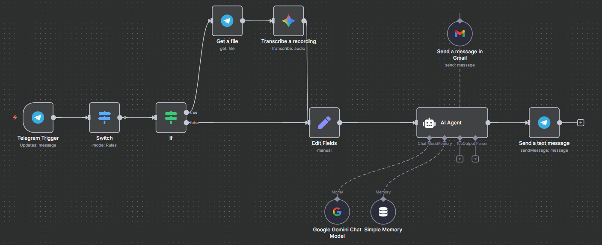

# Mail Automation Flow with n8n

This repository contains an **automation flow built with [n8n](https://n8n.io/)** for handling Telegram messages and automating email replies.  
It allows you to receive messages or audio recordings from Telegram, process them, and either send back a response in Telegram or automatically send an email via Gmail.

---

## ⚙️ Workflow Overview

The automation flow includes the following steps:

1. **Telegram Trigger**  
   - Listens for incoming Telegram messages.  
   - Supports both text and audio messages.

2. **Switch & If Conditions**  
   - Determines whether the input is text or audio.  
   - If audio → proceed to transcription.  
   - If text → pass directly to the next step.

3. **Get a File & Transcribe a Recording**  
   - Downloads the audio file from Telegram.  
   - Transcribes the audio into text for further processing.

4. **Edit Fields**  
   - Cleans or modifies the message data before sending it to the AI Agent.

5. **AI Agent (Google Gemini + Memory)**  
   - Uses Google Gemini Chat Model with memory.  
   - Interprets the message and decides whether to reply directly or forward as an email.

6. **Send Message in Gmail**  
   - If required, composes and sends an automated email via Gmail.

7. **Send a Text Message (Telegram)**  
   - Sends the AI Agent’s response directly back to the user in Telegram.

---

## 🚀 Use Cases

- **Customer Support**: Automate responses to customer queries from Telegram and forward important ones to email.  
- **Meeting Notes**: Transcribe and forward voice messages into email.  
- **Team Notifications**: Route critical Telegram updates to Gmail.  

---

## 🛠️ Requirements

- [n8n](https://n8n.io/) installed (self-hosted or cloud).  
- A Telegram Bot with valid API credentials.  
- Gmail API credentials for sending emails.  
- Access to Google Gemini Chat Model for AI Agent.  

---

## ▶️ How to Use

1. Import the provided flow JSON into your n8n instance.  
2. Configure the following credentials in n8n:  
   - **Telegram**: Bot Token  
   - **Gmail**: OAuth2 credentials  
   - **Google Gemini**: API key  
3. Activate the workflow.  
4. Test by sending a text or voice message to your Telegram bot.  

---

## 📌 Acknowledgements

- **n8n**: Open-source workflow automation tool.  
- **Telegram**: Used as input/output channel.  
- **Gmail**: For email automation.  
- **Google Gemini**: For AI-powered message processing and responses.  

---
